<p align="center">
  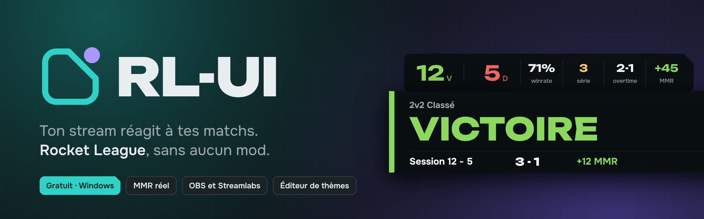
</p>

<p align="center">
  <a href="https://github.com/MaximeKwk/rl-ui/releases"></a>
  
  
  
  
  <a href="LICENSE"></a>
</p>

<p align="center">
  <b>RL-UI</b> compte tout seul tes victoires, tes défaites et ton MMR sur Rocket League,<br>et fait réagir ton stream quand tu gagnes, quand tu perds et quand la partie part en <b>overtime</b>.
</p>

<p align="center">
  <a href="README.md">English</a> · <b>Français</b>
</p>

<p align="center">
  <a href="https://github.com/MaximeKwk/rl-ui/releases"><b>Télécharger</b></a> ·
  <a href="#nouveautés-de-la-version-2">Nouveautés de la V2</a> ·
  <a href="#démarrage-rapide">Démarrage rapide</a> ·
  <a href="#overlays">Overlays</a> ·
  <a href="#thèmes">Thèmes</a> ·
  <a href="#faq">FAQ</a>
</p>

<p align="center">
  <a href="https://maximekwk.github.io/rl-ui/#video">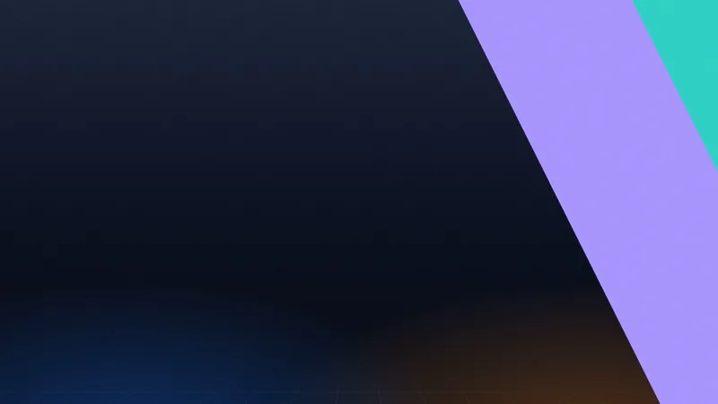</a><br>
  <sub>▶ <a href="https://maximekwk.github.io/rl-ui/#video">Voir la vidéo complète, avec le son (49 s)</a></sub>
</p>

> [!IMPORTANT]
> RL-UI n'utilise **aucun mod** : ni BakkesMod, ni injection dans le jeu. Il lit uniquement la **Stats API officielle** de Psyonix
> et le journal local du jeu. Il est donc compatible avec l'anti-triche (EAC).
> L'application n'est pas encore signée numériquement : au premier lancement, Windows SmartScreen peut afficher un avertissement
> (*Informations complémentaires → Exécuter quand même*).

## Nouveautés de la version 2

<table>
  <tr>
    <td width="50%">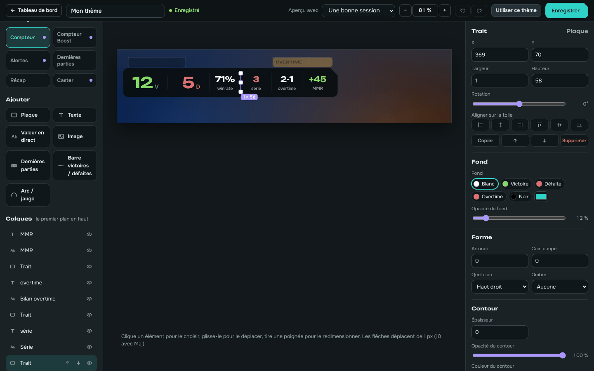</td>
    <td width="50%">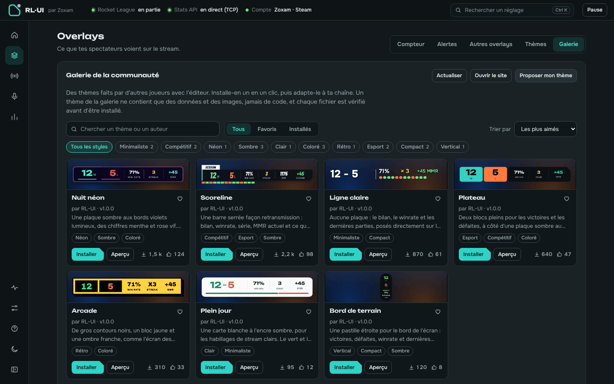</td>
  </tr>
  <tr>
    <td valign="top"><b>Éditeur de thèmes</b><br>Dessine ton overlay à la souris : plaques, textes, valeurs en direct, images. Compteur, compteur Boost, alertes, dernières parties, récap et overlay caster, sans toucher un fichier.</td>
    <td valign="top"><b>Galerie de la communauté</b><br>Des thèmes faits par d'autres joueurs, à installer en un clic. Publie le tien sur <a href="https://kydora.net/marketplace">kydora.net/marketplace</a>.</td>
  </tr>
  <tr>
    <td>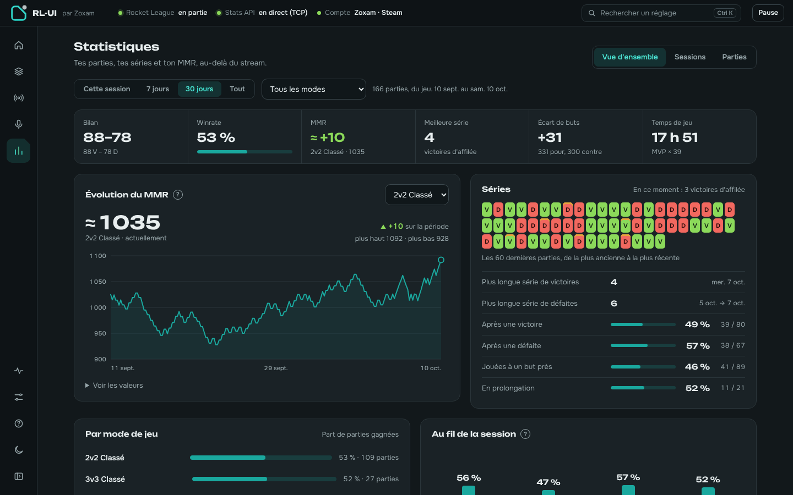</td>
    <td>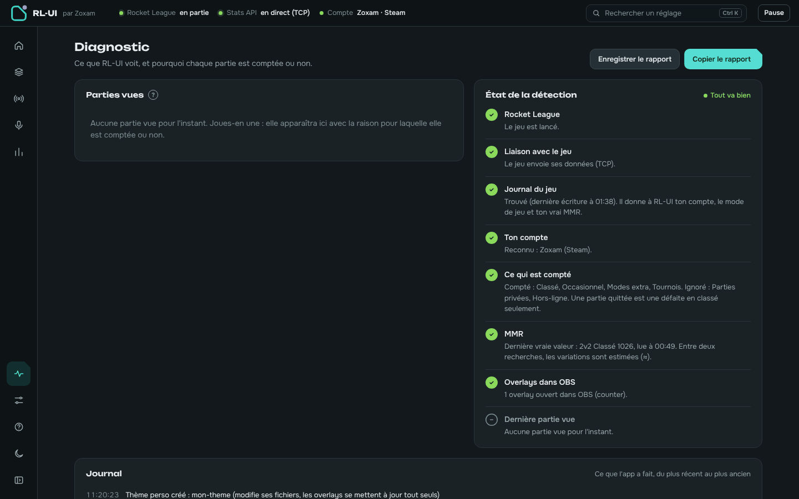</td>
  </tr>
  <tr>
    <td valign="top"><b>Statistiques</b><br>Courbe de MMR, séries, winrate par mode de jeu, sessions comparées entre elles, bilan de session à partager en image, export CSV.</td>
    <td valign="top"><b>Diagnostic</b><br>Chaque partie vue par RL-UI, avec la raison pour laquelle elle est comptée ou non, et un bouton pour la compter quand même.</td>
  </tr>
  <tr>
    <td>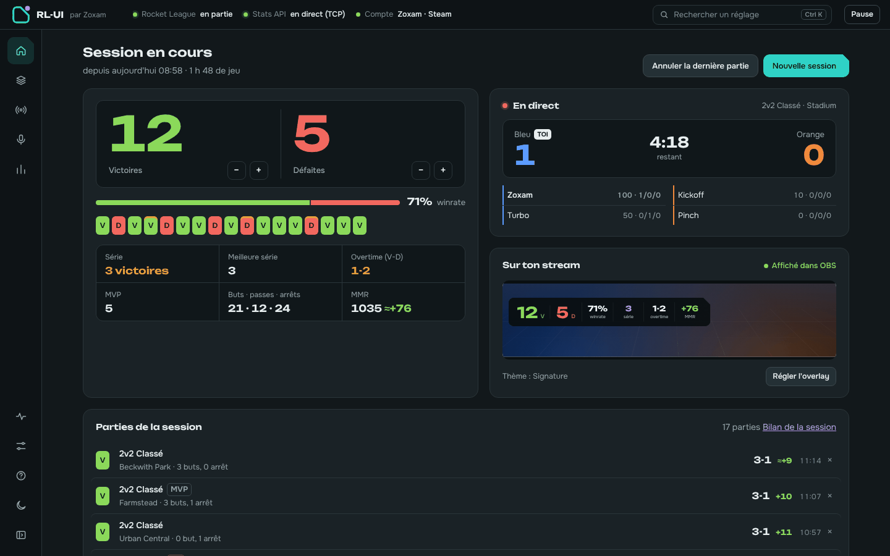</td>
    <td>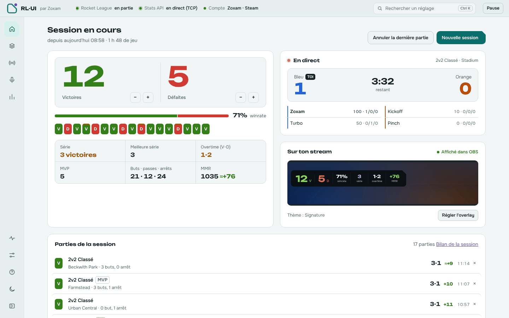</td>
  </tr>
  <tr>
    <td valign="top"><b>Nouvelle identité</b><br>Une interface refaite : accueil guidé, recherche d'un réglage, bulles d'aide, trois nouveaux thèmes d'overlay (Signature, Épuré, Contraste).</td>
    <td valign="top"><b>Clair ou sombre</b><br>L'app suit le thème de ton système. <b>Ajouter à OBS</b> pose chaque overlay en un clic, ou en glissant le bouton dans OBS.</td>
  </tr>
</table>

Le détail de chaque version est dans le [journal des versions](CHANGELOG.md).

## Aperçu

<table>
  <tr>
    <td width="50%">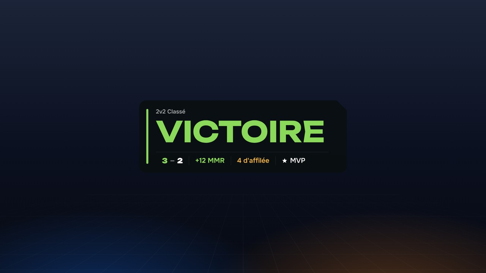</td>
    <td width="50%">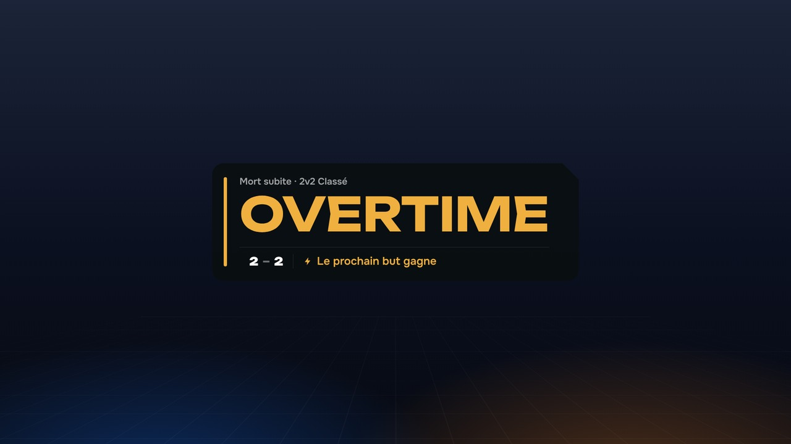</td>
  </tr>
  <tr>
    <td align="center"><b>Victoire</b> — score, série, MMR, MVP</td>
    <td align="center"><b>Overtime</b> — dès que la prolongation commence</td>
  </tr>
  <tr>
    <td width="50%">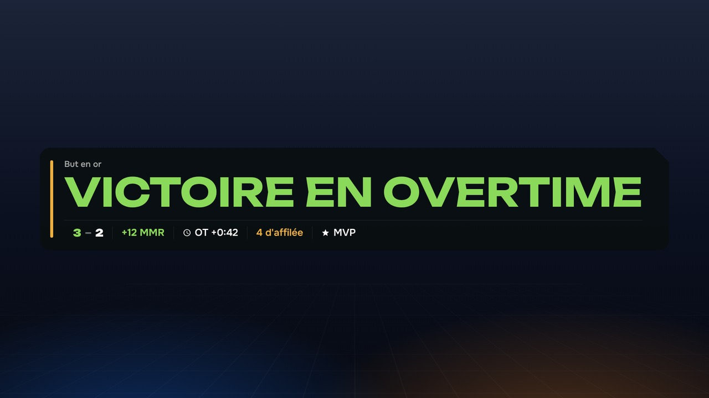</td>
    <td width="50%">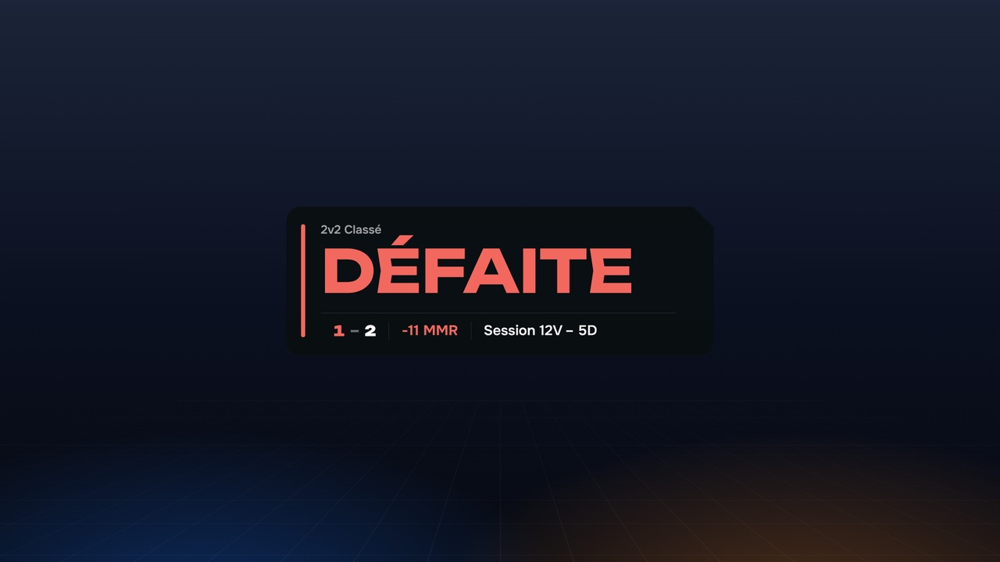</td>
  </tr>
  <tr>
    <td align="center"><b>Victoire en overtime</b> — but en or</td>
    <td align="center"><b>Défaite</b> — score et variation de MMR</td>
  </tr>
</table>

<table>
  <tr>
    <td>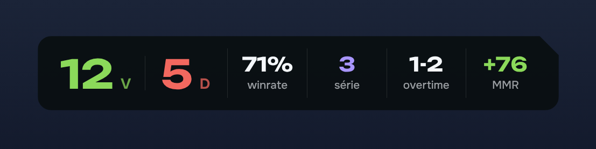</td>
    <td rowspan="3">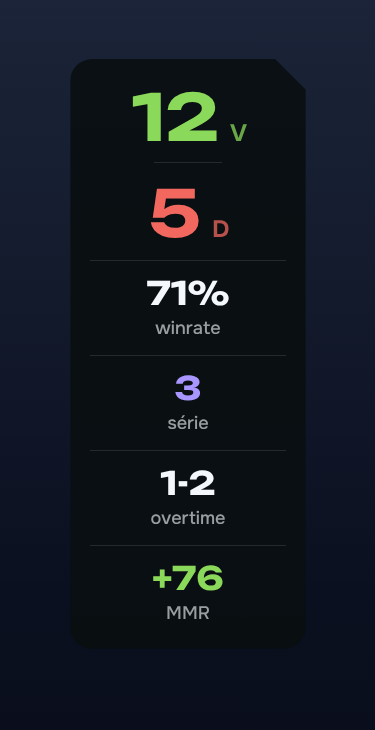</td>
  </tr>
  <tr>
    <td>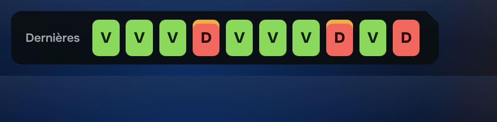</td>
  </tr>
  <tr>
    <td>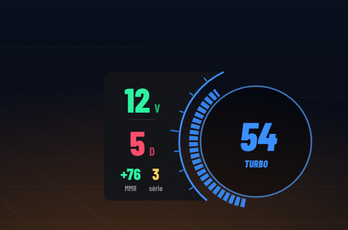</td>
  </tr>
  <tr>
    <td align="center">Compteur horizontal, dernières parties, et le mode <b>Boost</b> collé à la jauge du jeu, à la couleur de ton équipe</td>
    <td align="center">Vertical</td>
  </tr>
</table>

<p align="center">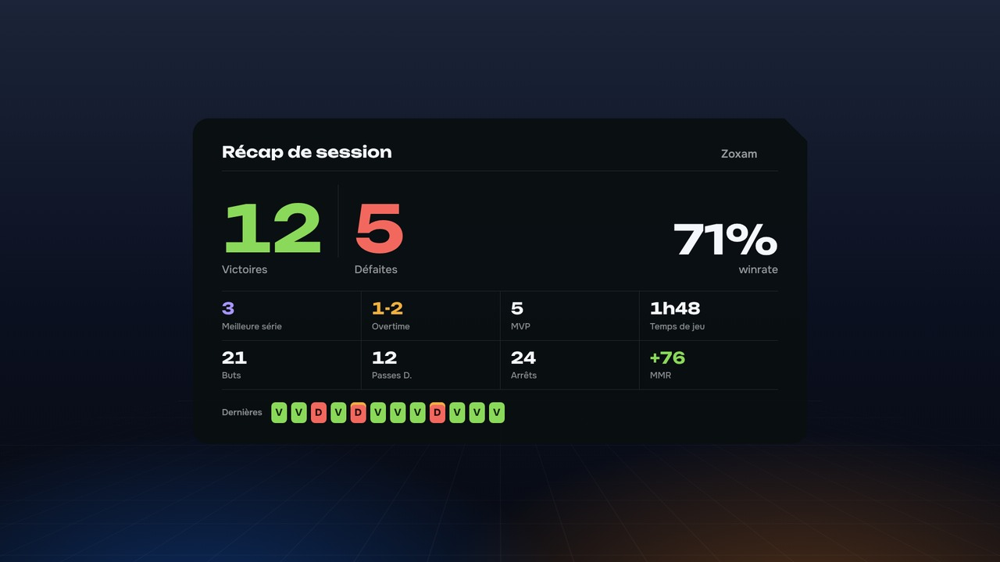<br><sub>Le récap de session, à afficher en fin de stream</sub></p>

## Comment ça marche

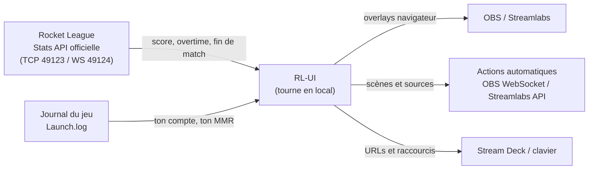
```mermaid
flowchart LR
    RL["Rocket League<br/>Stats API officielle<br/>(TCP 49123 / WS 49124)"] -->|score, overtime, fin de match| BS
    LOG["Journal du jeu<br/>Launch.log"] -->|ton compte, ton MMR| BS
    BS["RL-UI<br/>(tourne en local)"] -->|overlays navigateur| STREAM["OBS / Streamlabs"]
    BS -->|scènes et sources| ACT["Actions automatiques<br/>OBS WebSocket / Streamlabs API"]
    BS -->|URLs et raccourcis| DECK["Stream Deck / clavier"]
```

1. Rocket League diffuse en local les événements de la partie : buts, chrono, **overtime**, fin de match et vainqueur.
2. RL-UI lit le journal du jeu pour savoir **quel joueur est toi** (Steam ou Epic) et récupérer ton **MMR réel**.
3. Il enregistre chaque partie (victoire, défaite, OT, abandon, MVP…) et met à jour les overlays en direct, en moins d'une seconde.

## Démarrage rapide

**Prérequis :** Windows 10 ou 11 (64 bits), Rocket League sur PC (Steam ou Epic), OBS Studio 28+ ou Streamlabs Desktop.

1. **Installe** `RL-UI-Setup-x.y.z.exe` depuis les [Releases](https://github.com/MaximeKwk/rl-ui/releases)
   (ou la version portable, sans installation).
2. **Lance Rocket League** et joue une partie. La Stats API est activée d'office dans les versions récentes du jeu ; sinon
   *Réglages → Activer / réparer l'API* puis redémarre le jeu.
3. **Ajoute les overlays** dans OBS ou Streamlabs. Le plus simple : dans l'onglet Overlays, glisse le bouton **Glisser dans OBS** sur la fenêtre d'OBS, ou clique **Ajouter à OBS** une fois OBS connecté dans l'onglet Stream. À la main : *Sources → + → Navigateur*, colle l'URL (voir ci-dessous).

L'application est en anglais par défaut : passe-la en français dans *Settings → Language · Langue*.

Un petit assistant s'ouvre au premier lancement (tu peux le rouvrir depuis *Help*).

C'est tout : chaque victoire, défaite et overtime est détecté automatiquement.
L'app vit dans la zone de notification (icône **RL**) ; fermer la fenêtre ne l'arrête pas.

## Overlays

| Overlay | URL | Taille de la source |
| --- | --- | --- |
| Compteur horizontal | `http://127.0.0.1:5757/overlay/counter` | 1000 × 220 |
| Compteur vertical | `http://127.0.0.1:5757/overlay/counter?layout=vertical` | 340 × 720 |
| Compteur « Boost » | `http://127.0.0.1:5757/overlay/counter?layout=boost` | plein écran |
| Alertes | `http://127.0.0.1:5757/overlay/alerts` | plein écran |
| Dernières parties | `http://127.0.0.1:5757/overlay/history` | 700 × 90 |
| Récap de session | `http://127.0.0.1:5757/overlay/summary` | plein écran |
| Caster (spectateur) | `http://127.0.0.1:5757/overlay/caster` | plein écran |

> [!TIP]
> Pour entendre les alertes sur le stream, coche **« Contrôler l'audio via OBS »** dans les propriétés de la source.
> Les overlays suivent en direct les réglages du tableau de bord (thème, style, couleurs, textes, sons).

**Mode Boost** — le compteur se cale à gauche de la jauge de boost, son bord suit l'arc de la jauge et il prend la couleur de ton
équipe. Si ton HUD a une autre taille : *Overlays → Compteur → Afficher le repère*, ajuste la taille et la position jusqu'à ce
que le repère recouvre ta jauge dans OBS, puis masque-le.

<details>
<summary><b>Paramètres d'URL avancés</b></summary>

| Overlay | Paramètres |
| --- | --- |
| Compteur | `theme=arena\|broadcast\|minimal` · `layout=horizontal\|vertical\|boost` · `scale=1.3` · `align=left\|center\|right` · `hide=wr,streak,ot,mmr` · `mmr=session\|value\|both` · `bscale` · `bx` · `by` · `guide=1` |
| Alertes | `pos=center\|top\|bottom` · `scale` · `mute=1` · `only=overtime,ot_win` · `mmr=0` |
| Dernières parties | `n=5` · `order=old` · `bare=1` · `title=0` |
| Tous | thème `pack=contraste` · couleurs `win=2ef2a0&loss=ff4d6d&ot=ffb020` · aperçu `preview=1` |

</details>

## Thèmes

Change la DA de tous les overlays en un clic, ou crée la tienne avec tes images, ta police, tes couleurs et tes sons.

<p align="center">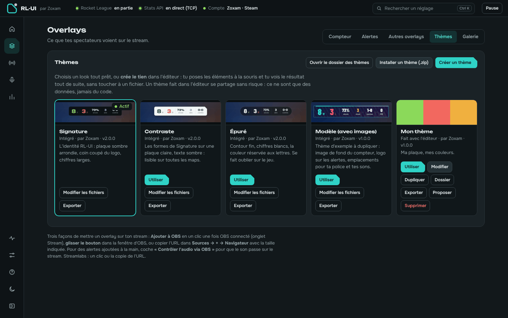</p>

<table>
  <tr>
    <td width="50%">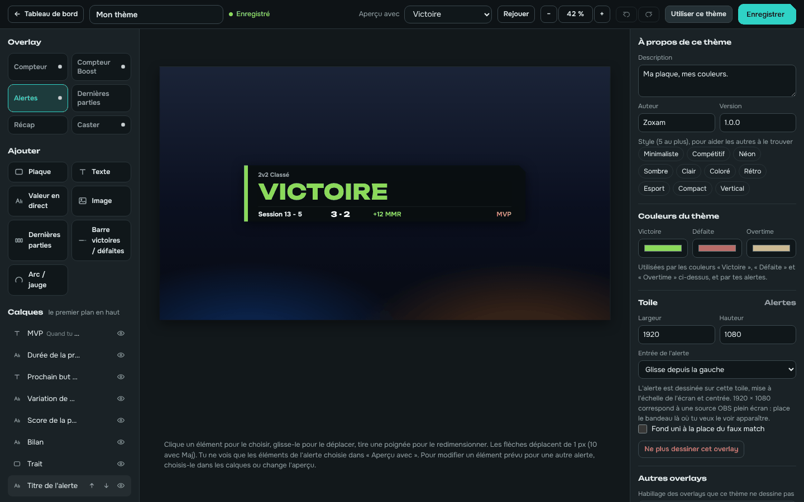</td>
    <td width="50%">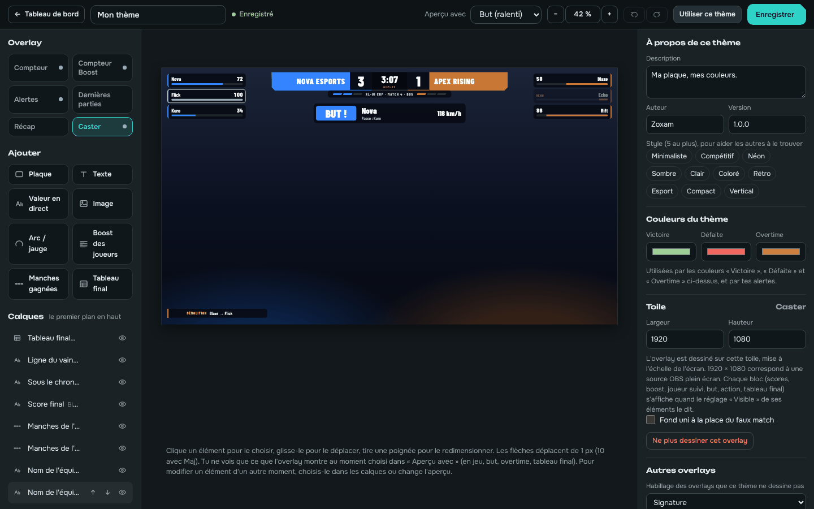</td>
  </tr>
  <tr>
    <td align="center">L'éditeur sur les <b>alertes</b> : un seul dessin, des éléments par événement</td>
    <td align="center">L'éditeur sur l'<b>overlay caster</b></td>
  </tr>
</table>

| | |
| --- | --- |
| **Thèmes intégrés** | Signature, Épuré, Contraste, et un **Modèle** avec images à dupliquer |
| **Éditeur de thèmes** | *Créer un thème* ouvre un éditeur visuel : tu poses à la souris des plaques, des textes, des valeurs en direct (victoires, winrate, MMR, série…), des images et les dernières parties, et tu vois le résultat tout de suite. Un thème dessine le compteur et, si tu veux, le compteur Boost, les alertes, les dernières parties, le récap de session et l'overlay caster. Aucun fichier à toucher |
| **Galerie de la communauté** | *Overlays → Galerie* : des thèmes faits par d'autres joueurs, avec recherche, styles, favoris, J'aime et aperçu en direct. Un clic pour installer, et les mises à jour sont proposées quand un créateur en publie une |
| **Partager le tien** | Le bouton *Proposer* vérifie ton thème et l'exporte ; tu le publies sur **[kydora.net/marketplace](https://kydora.net/marketplace)** avec un compte Twitch, Discord ou e-mail. Chaque thème a sa page, avec un bouton **Installer dans RL-UI** |
| **Sûr** | Un thème fait dans l'éditeur n'est que des données et des images : ni CSS, ni script. RL-UI vérifie chaque fichier d'un thème de la galerie (taille, empreinte, format) avant de l'installer |
| **Pour qui connaît le CSS** | *Modifier les fichiers* crée une copie modifiable d'un thème intégré et ouvre son dossier : images, couleurs de `theme.json`, `theme.css`. Les overlays se mettent à jour **en direct dans OBS** |

Format des thèmes de l'éditeur (ce qu'un thème peut contenir, versions, contrôles) : **[docs/THEME-FORMAT.fr.md](docs/THEME-FORMAT.fr.md)**. Thèmes à feuille de style : **[docs/THEMES.fr.md](docs/THEMES.fr.md)**.

## Mode caster

Pour caster un match en **spectateur** (tournoi, scrim, match privé) : un overlay de diffusion complet, alimenté en direct par la Stats API.

<table>
  <tr>
    <td>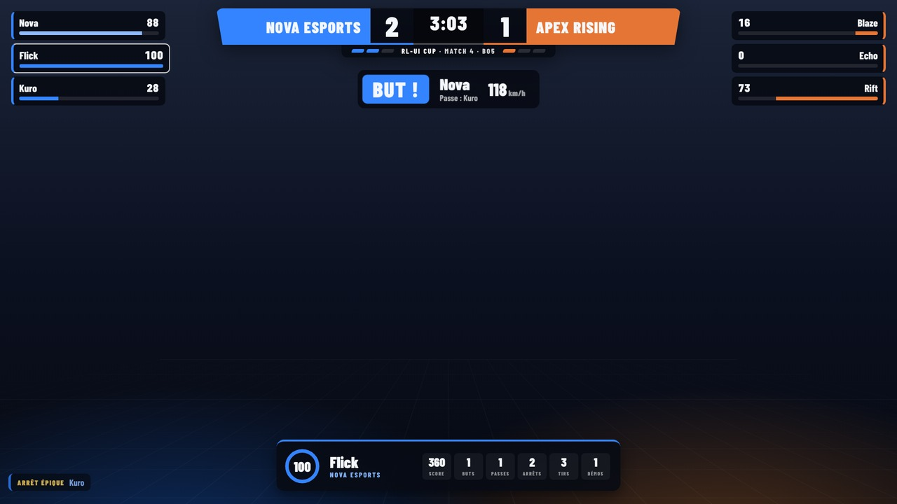</td>
    <td>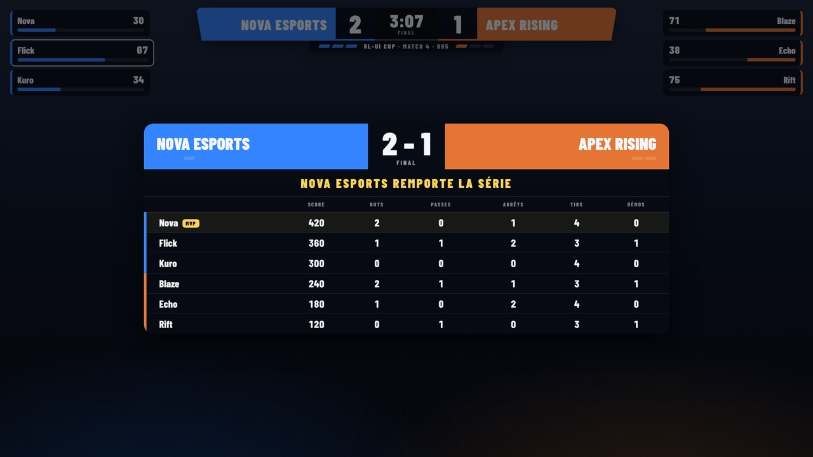</td>
  </tr>
</table>

| | |
| --- | --- |
| **Tableau des scores** | Noms d'équipe (ceux du jeu ou les tiens), score, chrono, overtime, replay, titre de l'événement |
| **Série** | BO1, BO3, BO5, BO7 : victoire comptée automatiquement à la fin de chaque match, boutons + / − et « Inverser les côtés » (aussi depuis un Stream Deck) |
| **Logos et photos** | Logos des équipes dans le tableau des scores et le tableau final, photos des joueurs sur la carte du joueur suivi |
| **Joueurs** | Boost de chacun, démolitions, carte du joueur suivi (boost, score, buts, passes, arrêts, tirs, démos) |
| **Actions** | Bannière de but (buteur, passe, vitesse en km/h ou mph), statfeed (démolitions, arrêts épiques…) |
| **Fin de match** | Tableau des stats de tous les joueurs, MVP, vainqueur du match ou de la série |

Source OBS : `http://127.0.0.1:5757/overlay/caster` en **plein écran**. Pour séparer les éléments dans plusieurs scènes :
`?hide=bug,boosts,target,goals,feed,post`. Pour des barres de boost fluides, passe la Stats API à 30 mises à jour/s
(bouton dans l'onglet **Caster**, puis redémarre Rocket League).

## Fonctionnalités

| | |
| --- | --- |
| **Détection automatique** | Victoire, défaite, overtime, forfait, abandon (défaite en classé), MVP, mode de jeu (2v2 classé, 3v3…) |
| **MMR réel** | Lu dans le journal du jeu, affiché en **+x** (vert) ou **−x** (rouge) ; estimation immédiate corrigée à la recherche suivante |
| **Alertes animées** | Victoire, défaite, overtime, victoire / défaite en OT, séries (3, 5, 10…), sons intégrés ou personnalisés |
| **Mode caster** | Overlay de diffusion pour caster en spectateur : scores, série BO, boost de tous les joueurs, joueur suivi, buts, tableau final |
| **Thèmes** | DA toute faite ou perso (images, police, couleurs, sons), installables et partageables en .zip |
| **Compteur** | 3 styles (Arena, Broadcast, Minimal), horizontal, vertical ou collé à la jauge de boost, badge OVERTIME en direct |
| **Sessions et historique** | Nouvelle session automatique après 6 h sans jouer, historique complet par mode, corrections manuelles |
| **Statistiques** | Vue d'ensemble d'une période (session, 7 jours, 30 jours, tout) par mode de jeu, courbe du MMR, séries, part de victoires après une victoire ou une défaite et au fil de la session, sessions comparées entre elles ou à ta moyenne, bilan de session en image à partager, export CSV |
| **Diagnostic** | Chaque partie vue avec la raison pour laquelle elle est comptée ou non, correction en un clic, bilan de santé de la détection, rapport à copier |
| **Commandes du chat** | `!wl`, `!mmr`, `!last`, `!streak`… avec réponse dans ton chat Twitch, et tes propres commandes |
| **Mises à jour automatiques** | Les nouvelles versions se téléchargent en arrière-plan ; un clic pour installer |
| **Langues** | Anglais par défaut, français en option (interface, overlays, alertes, noms des modes) |
| **Identification** | Ton compte Steam / Epic est reconnu seul : fonctionne en solo, duo et trio |

## Intégrations

| Intégration | Ce que ça fait | Mise en place |
| --- | --- | --- |
| **OBS Studio** 28+ | Affiche une source ou change de scène sur overtime, victoire, défaite, série | *Outils → Paramètres du serveur WebSocket* → copier le mot de passe |
| **Streamlabs Desktop** | Les mêmes actions automatiques | *Paramètres → Contrôle à distance* → *Afficher les détails* → copier le jeton |
| **Stream Deck** | +1 victoire / défaite, annuler, pause, nouvelle session | Action *Site web* + « Accéder en arrière-plan » avec les URL de *Réglages* |
| **Raccourcis clavier** | `Ctrl+Alt+Shift+↑` / `↓` / `Retour arrière` | Actifs même en jeu, personnalisables |
| **Fichiers texte** | `wins.txt`, `record.txt`, `mmr-session.txt`… pour une source « Texte (GDI+) » | `%APPDATA%\RL-UI\texte` |
| **HTTP** | `/api/text/record`, `/api/text/mmrsession`… | Streamer.bot, Touch Portal, etc. |

## FAQ

<details>
<summary><b>Est-ce que je risque un ban ?</b></summary>

RL-UI ne modifie pas le jeu et ne s'y injecte pas : il lit la Stats API officielle, prévue par Psyonix pour les overlays,
et le fichier journal que le jeu écrit sur ton disque.
</details>

<details>
<summary><b>D'où vient le MMR ?</b></summary>

Quand tu lances une recherche de partie (seul ou chef de groupe), Rocket League écrit ton MMR pour le mode choisi dans son journal.
La variation exacte d'un match est donc connue à la recherche suivante ; en attendant, RL-UI affiche une estimation basée sur
tes vraies variations récentes. Si c'est ton mate qui lance la recherche, seule l'estimation est disponible.
</details>

<details>
<summary><b>Une partie n'a pas été comptée</b></summary>

Ouvre **Diagnostic** dans le tableau de bord : chaque partie signalée par le jeu y est listée avec la raison pour laquelle elle
est comptée ou non (mode exclu, suivi en pause, compte non reconnu, partie quittée…). Une partie non comptée peut être ajoutée
d'un clic, avec son vrai score. La même page vérifie chaque maillon de la détection (jeu, Stats API, journal du jeu, compte, MMR)
et prépare un rapport à copier pour demander de l'aide.
</details>

<details>
<summary><b>« Stats API : non joignable » alors que le jeu tourne</b></summary>

*Réglages → Activer / réparer l'API*, puis redémarre complètement Rocket League (nécessaire aussi après certaines mises à jour du jeu).
</details>

<details>
<summary><b>J'ai un setup à deux PC</b></summary>

*Réglages → Serveur local → Accessible depuis le réseau local*, puis utilise l'adresse IP du PC de jeu dans les URL des overlays.
</details>

## Confidentialité

RL-UI suit tes parties **entièrement en local** : tes parties et tes statistiques ne quittent jamais ton PC (`%APPDATA%\RL-UI\data.json`), il n'y a ni télémétrie ni compte à créer.

Il ne va en ligne que pour ce que tu vois : la recherche de mises à jour (GitHub), le chat Twitch si tu le connectes, et la galerie de thèmes quand tu ouvres son onglet. Parcourir la galerie n'envoie rien sur toi ; installer un thème indique à la galerie quel thème a été installé, pour son compteur d'installations, et rien d'autre.

## Sécurité

RL-UI fonctionne uniquement sur ton PC : le tableau de bord et chaque action demandent une clé locale aléatoire, un site web ouvert dans ton navigateur ne peut pas lire le flux en direct, et un thème ne peut pas contenir de code. Détails et signalement d'un problème en privé : **[SECURITY.md](SECURITY.md)**.

## Développement

```bash
npm install
npm start          # lance l'application (Electron)
npm test           # tests unitaires : tracker, MMR, journal du jeu, OBS / Streamlabs…
npm run e2e        # test de bout en bout avec un faux Rocket League
npm run dist       # installeur + version portable dans dist/
```

<details>
<summary><b>Outils de développement</b></summary>

```bash
node tools/simulator.js otwin win loss --speed 10                     # faux Rocket League (TCP 49123 + WebSocket 49124)
node tools/simulator.js win loss --log <Launch.log> --mmr 1150 --lag  # + journal du jeu avec MMR
node tools/sniff.js 120 capture.jsonl                                 # enregistre le flux brut du vrai jeu
npm run headless                                                      # tracker sans interfacenpx electron tools/promo/render.js rl-ui-2.mp4 --lang=fr              # la vidéo de présentation (tools/promo/promo.html, ffmpeg requis)
```

| Dossier | Contenu |
| --- | --- |
| `core/` | Logique sans Electron : client Stats API, tracker, MMR, serveur des overlays, OBS / Streamlabs |
| `web/` | Tableau de bord et overlays (HTML / CSS / JS, sans framework) |
| `electron/` | Fenêtre, zone de notification, raccourcis globaux |
| `tools/` · `test/` | Simulateur, captures, tests |

**Publier une version** : mettre à jour `version` dans `package.json` et le [journal des versions](CHANGELOG.md), puis
`git tag vX.Y.Z && git push --tags`. Le workflow GitHub teste, compile et joint les `.exe` à la release.
</details>

## Avertissement

RL-UI est un projet indépendant. Il n'est ni affilié, ni approuvé, ni sponsorisé par **Psyonix LLC** ou **Epic Games, Inc.**
*Rocket League* est une marque de Psyonix LLC.

## Licence

© 2026 Zoxam — tous droits réservés. Voir [LICENSE](LICENSE).
Polices [Unbounded](web/assets/fonts/OFL-Unbounded.txt), [Onest](web/assets/fonts/OFL-Onest.txt), [Barlow Condensed](web/assets/fonts/OFL-BarlowCondensed.txt) et [Archivo](web/assets/fonts/OFL-Archivo.txt) sous SIL Open Font License.

## À propos

Créé par **Zoxam**. Une idée, un bug ? Ouvre une [issue](https://github.com/MaximeKwk/rl-ui/issues).

RL-UI est gratuit et le reste. S'il t'aide sur ton stream, tu peux [laisser un pourboire sur Ko-fi](https://ko-fi.com/maximekwk) pour soutenir son développement.
