<p align="center">
  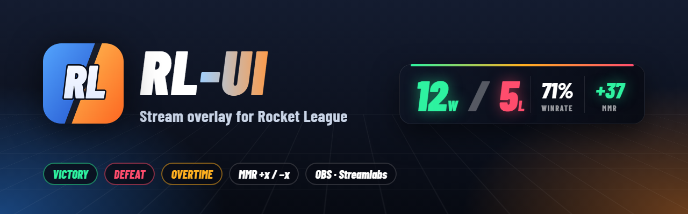
</p>

<p align="center">
  <a href="https://github.com/MaximeKwk/rl-ui/releases"></a>
  
  
  
  <a href="LICENSE"></a>
</p>

<p align="center">
  <b>RL-UI</b> tracks your Rocket League wins, losses and MMR automatically,<br>
  and makes your stream react when you win, when you lose and when the game goes to <b>overtime</b>.
</p>

<p align="center">
  <b>English</b> · <a href="README.fr.md">Français</a>
</p>

<p align="center">
  <a href="#quick-start">Quick start</a> ·
  <a href="#preview">Preview</a> ·
  <a href="#how-it-works">How it works</a> ·
  <a href="#overlays">Overlays</a> ·
  <a href="#caster-mode">Caster mode</a> ·
  <a href="#faq">FAQ</a>
</p>

> [!IMPORTANT]
> RL-UI uses **no mods**: no BakkesMod, no injection into the game. It only reads Psyonix's **official Stats API**
> and the game's local log file, so it is compatible with the anti-cheat (EAC).
> The app is not code-signed yet: on first launch, Windows SmartScreen may show a warning
> (*More info → Run anyway*).

## Preview

<table>
  <tr>
    <td width="50%">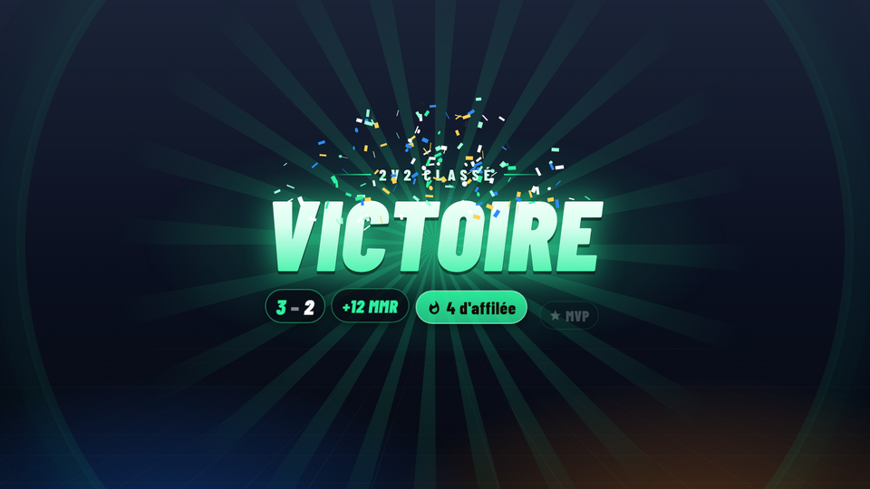</td>
    <td width="50%">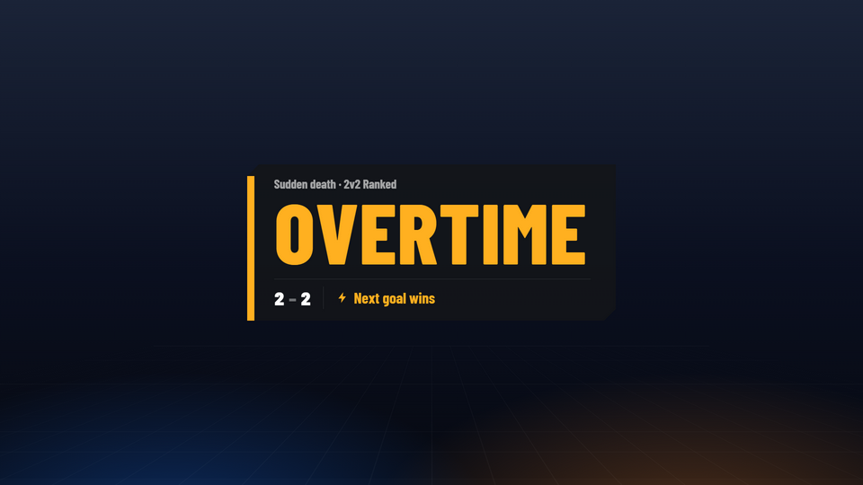</td>
  </tr>
  <tr>
    <td align="center"><b>Victory</b> — score, streak, MMR, MVP</td>
    <td align="center"><b>Overtime</b> — as soon as overtime starts</td>
  </tr>
  <tr>
    <td width="50%">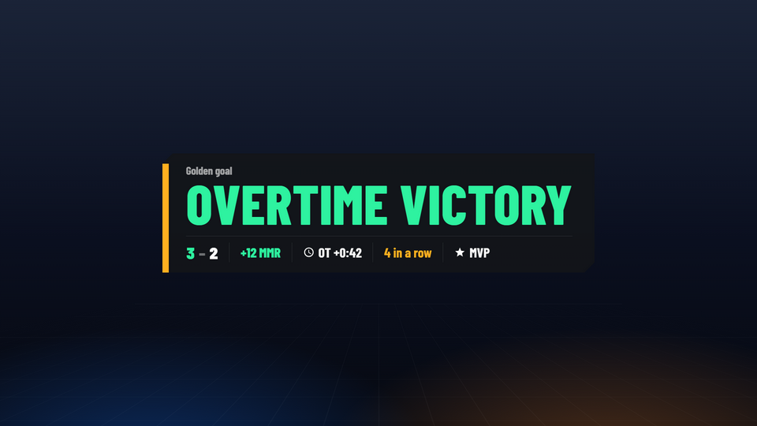</td>
    <td width="50%">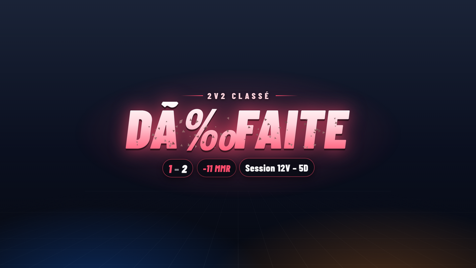</td>
  </tr>
  <tr>
    <td align="center"><b>Overtime victory</b> — golden goal</td>
    <td align="center"><b>Defeat</b> — score and MMR change</td>
  </tr>
</table>

<table>
  <tr>
    <td>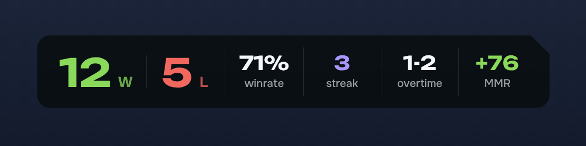</td>
    <td rowspan="2">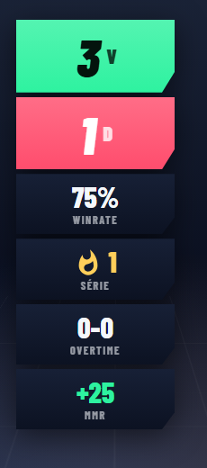</td>
  </tr>
  <tr>
    <td>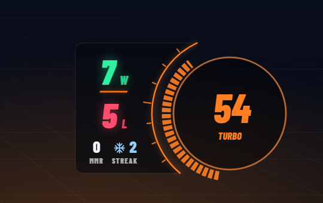</td>
  </tr>
  <tr>
    <td align="center">Horizontal counter, and <b>Boost</b> mode stuck to the in-game boost gauge, in your team's color</td>
    <td align="center">Vertical</td>
  </tr>
</table>

<p align="center">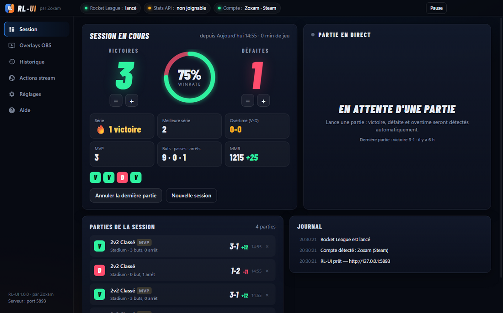</p>

## How it works

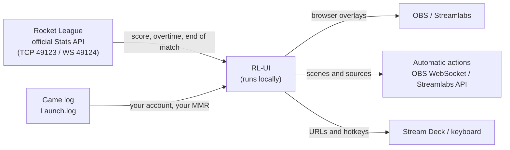

1. Rocket League broadcasts match events locally: goals, clock, **overtime**, end of match and winner.
2. RL-UI reads the game log to know **which player is you** (Steam or Epic) and to get your **real MMR**.
3. It records every match (win, loss, OT, early leave, MVP…) and updates the overlays live, in under a second.

## Quick start

**Requirements:** Windows 10 or 11 (64-bit), Rocket League on PC (Steam or Epic), OBS Studio 28+ or Streamlabs Desktop.

1. **Install** `RL-UI-Setup-x.y.z.exe` from the [Releases](https://github.com/MaximeKwk/rl-ui/releases)
   (or the portable version, no install needed).
2. **Launch Rocket League** and play a match. The Stats API is enabled by default in recent versions of the game; otherwise
   *Settings → Enable / repair the API*, then restart the game.
3. **Add the overlays** in OBS or Streamlabs. Easiest: in the Overlays tab, drag the **Drag into OBS** button onto the OBS window, or click **Add to OBS** once OBS is connected in the Stream tab. By hand: *Sources → + → Browser*, paste the URL (see below).

A short guided setup opens on first launch (you can reopen it from *Help*).

That's it: every win, loss and overtime is detected automatically.
The app lives in the system tray (**RL** icon); closing the window doesn't stop it.
The interface is in English by default; French is available in *Settings → Language · Langue*.

## Overlays

| Overlay | URL | Source size |
| --- | --- | --- |
| Horizontal counter | `http://127.0.0.1:5757/overlay/counter` | 1000 × 220 |
| Vertical counter | `http://127.0.0.1:5757/overlay/counter?layout=vertical` | 340 × 720 |
| “Boost” counter | `http://127.0.0.1:5757/overlay/counter?layout=boost` | full screen |
| Alerts | `http://127.0.0.1:5757/overlay/alerts` | full screen |
| Recent matches | `http://127.0.0.1:5757/overlay/history` | 700 × 90 |
| Session recap | `http://127.0.0.1:5757/overlay/summary` | full screen |
| Caster (spectator) | `http://127.0.0.1:5757/overlay/caster` | full screen |

> [!TIP]
> To hear the alerts on stream, tick **“Control audio via OBS”** in the source properties.
> Overlays follow the dashboard settings live (theme, style, colors, texts, sounds, language).

**Boost mode** — the counter snaps to the left of the boost gauge, its edge follows the gauge's arc and it takes your team's
color. If your HUD has a different size: *Overlays → Counter → Show the gauge guide*, adjust the size and position until
the guide covers your gauge in OBS, then hide it.

<details>
<summary><b>Advanced URL parameters</b></summary>

| Overlay | Parameters |
| --- | --- |
| Counter | `theme=arena\|broadcast\|minimal` · `layout=horizontal\|vertical\|boost` · `scale=1.3` · `align=left\|center\|right` · `hide=wr,streak,ot,mmr` · `mmr=session\|value\|both` · `bscale` · `bx` · `by` · `guide=1` |
| Alerts | `pos=center\|top\|bottom` · `scale` · `mute=1` · `only=overtime,ot_win` · `mmr=0` |
| Recent matches | `n=5` · `order=old` · `bare=1` · `title=0` |
| Caster | `hide=bug,boosts,target,goals,feed,post` · `scale` |
| All | theme `pack=contraste` · colors `win=2ef2a0&loss=ff4d6d&ot=ffb020` · preview `preview=1` |

</details>

## Themes

Change the look of every overlay in one click, or build your own with your images, font, colors and sounds.

<p align="center">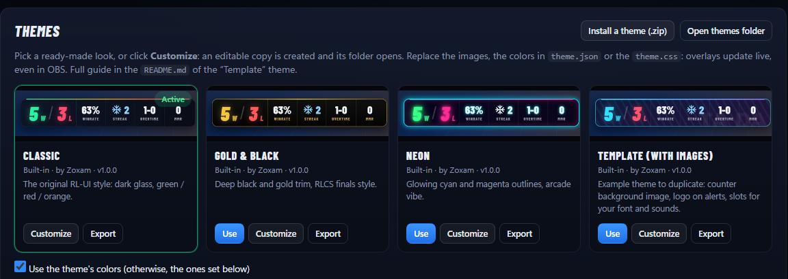</p>

| | |
| --- | --- |
| **Built-in themes** | Signature, Minimal, Contrast, and a **Template** with images, ready to duplicate |
| **Theme editor** | *Create a theme* opens a visual editor: place plates, texts, live values (wins, win rate, MMR, streak…), images and the last matches with the mouse, see the result right away. A theme draws the counter and, if you want, the alerts, the recent matches and the session recap. No file to touch |
| **Community gallery** | *Overlays → Gallery*: themes made by other players, with search, styles, favorites, likes and a live preview. One click to install, and updates are offered when a creator publishes one |
| **Share yours** | The *Share* button checks your theme and exports it; you publish it on **[kydora.net/marketplace](https://kydora.net/marketplace)** with a Twitch, Discord or e-mail account. Every theme has its own page, with an **Install in RL-UI** button |
| **Safe** | A theme made in the editor is only data and images: no CSS, no script. RL-UI checks every file of a gallery theme (size, fingerprint, format) before installing it |
| **For people who know CSS** | *Edit the files* creates an editable copy of a built-in theme and opens its folder: images, colors in `theme.json`, `theme.css`. Overlays update **live in OBS** |

Format of editor themes (what a theme may contain, versions, checks): **[docs/THEME-FORMAT.md](docs/THEME-FORMAT.md)**. Themes with a style sheet: **[docs/THEMES.md](docs/THEMES.md)**.

## Caster mode

To cast a match as a **spectator** (tournament, scrim, private match): a full broadcast overlay, fed live by the Stats API.

<table>
  <tr>
    <td>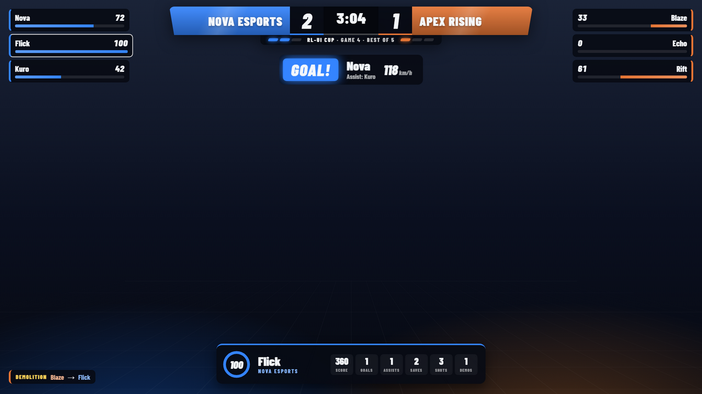</td>
    <td>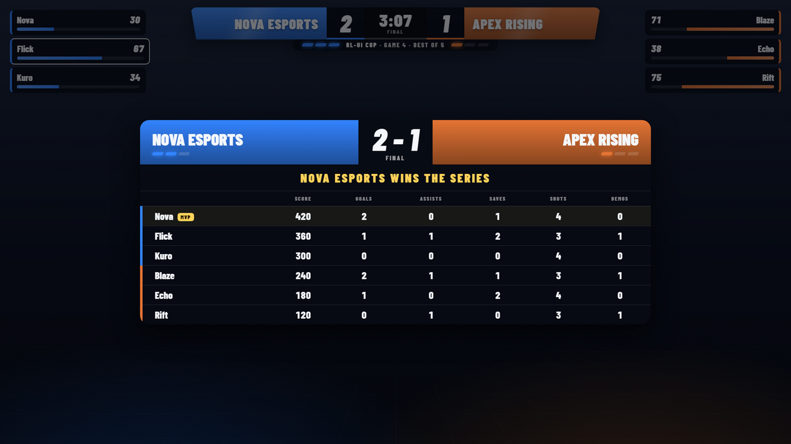</td>
  </tr>
</table>

| | |
| --- | --- |
| **Scorebug** | Team names (the game's or your own), score, clock, overtime, replay, event title |
| **Series** | Bo1, Bo3, Bo5, Bo7: the winner is counted automatically at the end of each game, + / − and “Swap sides” buttons (also from a Stream Deck) |
| **Logos and photos** | Team logos in the scorebug and final scoreboard, player photos on the spectated player card |
| **Players** | Everyone's boost, demolitions, spectated player card (boost, score, goals, assists, saves, shots, demos) |
| **Plays** | Goal banner (scorer, assist, speed in km/h or mph), statfeed (demolitions, epic saves…) |
| **End of match** | Stats of every player, MVP, winner of the game or of the series |

OBS source: `http://127.0.0.1:5757/overlay/caster` in **full screen**. To split the parts across several scenes:
`?hide=bug,boosts,target,goals,feed,post`. For smooth boost bars, set the Stats API to 30 updates/s
(button in the **Caster** tab, then restart Rocket League).

## Features

| | |
| --- | --- |
| **Automatic detection** | Win, loss, overtime, forfeit, early leave (loss in ranked), MVP, game mode (2v2 ranked, 3v3…) |
| **Real MMR** | Read from the game log, shown as **+x** (green) or **−x** (red); instant estimate corrected at the next search |
| **Animated alerts** | Victory, defeat, overtime, OT victory / defeat, win streaks (3, 5, 10…), built-in or custom sounds |
| **Caster mode** | Broadcast overlay for casting as a spectator: scores, Bo series, every player's boost, spectated player, goals, final scoreboard |
| **Themes** | Ready-made or custom looks (images, font, colors, sounds), installable and shareable as .zip |
| **Counter** | 3 styles (Arena, Broadcast, Minimal), horizontal, vertical or next to the boost gauge, live OVERTIME badge |
| **Sessions and history** | New session automatically after 6 h without playing, full history per mode, manual corrections |
| **Statistics** | Overview of a period (session, 7 days, 30 days, all time) per game mode, MMR curve, streaks, win rate after a win or a loss and as the session goes on, sessions compared with each other or with your average, session recap as an image to share, CSV export |
| **Diagnostic** | Every match seen with the reason it was counted or not, one-click correction, health check of the detection, report to copy |
| **Chat commands** | `!wl`, `!mmr`, `!last`, `!streak`… answered in your Twitch chat, plus your own commands |
| **Automatic updates** | New versions download in the background; one click to install |
| **Languages** | English by default, French available (interface, overlays, alerts, mode names) |
| **Identification** | Your Steam / Epic account is recognized on its own: works in solo, duos and trios |

## Integrations

| Integration | What it does | Setup |
| --- | --- | --- |
| **OBS Studio** 28+ | Shows a source or switches scene on overtime, win, loss, streak | *Tools → WebSocket Server Settings* → copy the password |
| **Streamlabs Desktop** | The same automatic actions | *Settings → Remote Control* → *Show details* → copy the token |
| **Stream Deck** | +1 win / loss, undo, pause, new session, caster series | *Website* action + “GET request in background” with the URLs from *Settings* |
| **Hotkeys** | `Ctrl+Alt+Shift+↑` / `↓` / `Backspace` | Work even in game, customizable |
| **Text files** | `wins.txt`, `record.txt`, `mmr-session.txt`… for a “Text (GDI+)” source | `%APPDATA%\RL-UI\texte` |
| **HTTP** | `/api/text/record`, `/api/text/mmrsession`… | Streamer.bot, Touch Portal, etc. |

## FAQ

<details>
<summary><b>Can I get banned?</b></summary>

RL-UI doesn't modify the game or inject anything into it: it reads the official Stats API, made by Psyonix for overlays,
and the log file the game writes on your disk.
</details>

<details>
<summary><b>Where does the MMR come from?</b></summary>

When you start a matchmaking search (solo or party leader), Rocket League writes your MMR for the chosen mode in its log.
The exact change of a match is therefore known at the next search; meanwhile, RL-UI shows an estimate based on
your recent real changes. If your teammate starts the search, only the estimate is available.
</details>

<details>
<summary><b>A match wasn't counted</b></summary>

Open **Diagnostic** in the dashboard: every match the game reported is listed with the reason it was counted or not
(excluded mode, tracking paused, account not recognized, match left…). A match that was not counted can be added in one click,
with its real score. The same page checks every link of the detection (game, Stats API, game log, account, MMR) and prepares a
report you can copy when asking for help.
</details>

<details>
<summary><b>“Stats API: unreachable” while the game is running</b></summary>

*Settings → Enable / repair the API*, then fully restart Rocket League (also needed after some game updates).
</details>

<details>
<summary><b>I have a two-PC setup</b></summary>

*Settings → Local server → Reachable from the local network*, then use the gaming PC's IP address in the overlay URLs.
</details>

## Privacy

RL-UI tracks your matches **entirely locally**: your matches and statistics never leave your PC (`%APPDATA%\RL-UI\data.json`), there is no telemetry and no account to create.

It only goes online for things you can see: checking for updates (GitHub), the Twitch chat if you connect it, and the theme gallery when you open its tab. Browsing the gallery sends nothing about you; installing a theme tells the gallery which theme was installed, for its install counter, and nothing else.

## Security

RL-UI runs on your PC only: the dashboard and every action need a random local key, websites open in your browser can't read the live feed, and themes can't contain code. Details and how to report a problem privately: **[SECURITY.md](SECURITY.md)**.

## Development

```bash
npm install
npm start          # run the app (Electron)
npm test           # unit tests: tracker, MMR, game log, OBS / Streamlabs, themes, caster…
npm run e2e        # end-to-end test with a fake Rocket League
npm run dist       # installer + portable version in dist/
```

<details>
<summary><b>Development tools</b></summary>

```bash
node tools/simulator.js otwin win loss --speed 10                     # fake Rocket League (TCP 49123 + WebSocket 49124)
node tools/simulator.js spectate --speed 10                           # spectated match (caster mode)
node tools/simulator.js win loss --log <Launch.log> --mmr 1150 --lag  # + game log with MMR
node tools/sniff.js 120 capture.jsonl                                 # record the raw feed of the real game
npm run headless                                                      # tracker without UI
```

| Folder | Content |
| --- | --- |
| `core/` | Logic without Electron: Stats API client, tracker, MMR, caster feed, overlay server, OBS / Streamlabs |
| `web/` | Dashboard, overlays and themes (HTML / CSS / JS, no framework); translations in `web/shared/i18n.js` |
| `electron/` | Window, system tray, global hotkeys |
| `tools/` · `test/` | Simulator, screenshots, tests |

**Releasing a version**: update `version` in `package.json` and the [changelog](CHANGELOG.md), then
`git tag vX.Y.Z && git push --tags`. The GitHub workflow tests, builds and attaches the `.exe` files to the release.
</details>

## Disclaimer

RL-UI is an independent project. It is not affiliated with, endorsed or sponsored by **Psyonix LLC** or **Epic Games, Inc.**
*Rocket League* is a trademark of Psyonix LLC.

## License

© 2026 Zoxam — all rights reserved. See [LICENSE](LICENSE).
[Barlow Condensed](web/assets/fonts/OFL-BarlowCondensed.txt) font under the SIL Open Font License.

## About

Made by **Zoxam**. An idea, a bug? Open an [issue](https://github.com/MaximeKwk/rl-ui/issues).
